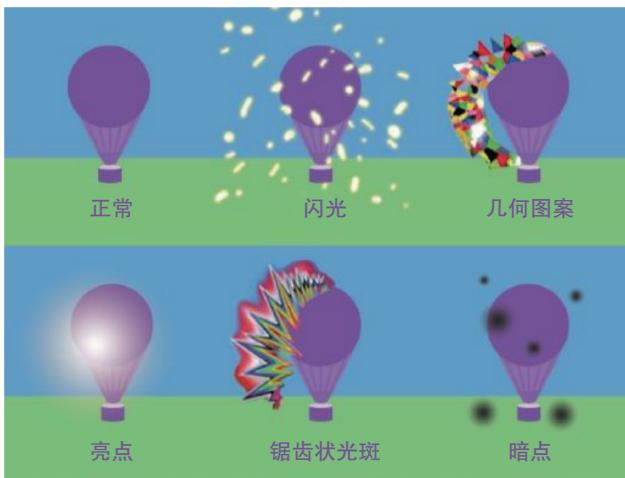
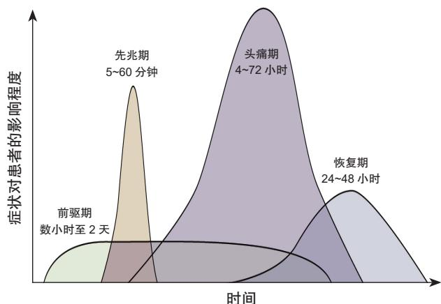

# • 指南与规范 •

# 中国偏头痛诊治指南（患者版）

中国研究型医院学会头痛与感觉障碍专业委员会

摘 要 偏头痛是一种普遍且严重影响生活质量的神经系统疾病，在我国成年人中的年患病率高达$9 . 3 \%$ 。为了更好地指导患者及其照护者进行科学管理，中国研究型医院学会头痛与感觉障碍专业委员会组织编制了《中国偏头痛诊治指南（患者版）》。本指南综合了临床专家、患者以及公众的意见，依据最新的科学证据和实践经验，围绕30个核心问题展开，内容覆盖偏头痛的基本认知、诊断、急性发作处理、预防性治疗方案以及生活方式管理建议。此外，指南还特别关注了药物过度使用性头痛、月经性偏头痛和卵圆孔未闭等特殊情况。本指南旨在提升患者的自我管理能力，促进医患之间的有效沟通，共同制订个性化的治疗方案，从而改善患者的生活质量。

关键词 偏头痛；指南；患者版；诊断；治疗；预防

# 一、为什么需要制订患者版的医学指南？

近年来，中国医师协会神经内科医师分会和中国研究型医院学会头痛与感觉障碍专业委员会相继发布了4部偏头痛领域权威医学指南或专家共识（以下简称“医师版指南”），包括《中国偏头痛诊治指南（2022 版）》《中国偏头痛急性期治疗指南（第一版）》《中国药物过度使用性头痛诊治指南（第一版）》及《月经性偏头痛诊断和治疗中国专家共识（2025 版）》[1~4]，为临床医疗专业人员提供了详尽而规范的指导。

然而，随着医疗信息的日益公开和患者自我管理意识的增强，迫切需要为众多偏头痛患者提供具有针对性的健康指导。《健康中国行动（ $2 0 1 9 \sim 2 0 3 0$ 年）》[5] 明确提出，鼓励个人和家庭在面对健康问题时，主动获取、理解和应用相关健康信息。同时该行动也倡导医务人员开发健康教育材料，以满足患者及公众日益增长的健康信息需求。因此，编制科学、权威的患者版医学指南已成为提升全民健康素养的关键举措。为顺应这一趋势，并助力患者更有效地管理偏头痛，中国研究型医院学会头痛与感觉障碍专业委员会组织编制了《中国偏头痛诊治指南（患者版）》。本指南融合最新科学证据和专家实践经验，内容通俗易懂、实用可靠，旨在帮助患者在日常生活中作出明智的健康决策，并积极参与自身的诊治过程。

# 二、本指南适用人群

已确诊或疑似偏头痛的成人患者；偏头痛患者

的家属及照护者；健康管理者及健康教育从业者；头痛相关领域的医护人员。

# 三、指南制订过程

# 1. 如何确定患者需求？

作为头痛领域首部患者版指南，其制订工作的首要目标在于切实满足患者需求。为此，指南执笔团队首先对临床医师和患者展开了系统调研，并通过集中讨论，初步拟定了 38 个临床问题。随后，在11个偏头痛患者社群中（总计成员超过5000人）发起了电子问卷调查，邀请患者对这些问题的重要性进行评价，并补充提交其他开放性临床问题。通过此过程，共收集到 669 份有效问卷，其中包含507 条开放性反馈意见。在综合分析所有调研数据的基础上，最终遴选出 30 个核心问题，涵盖 10 个主要专题。

# 2. 如何形成推荐意见？

确定临床问题列表之后，在制订推荐意见的过程中基于最新的科学研究证据和临床专家经验，同时充分考虑患者的经济及用药偏好、治疗的可获得性及相关的利弊因素。对于 4 部医师版指南能够直接回答的问题，本指南在原有内容基础上进行了适当改编；对于未涵盖的问题，则通过广泛的文献检索，参照国内外最新的科学证据，构建新的推荐意见。制订专家组全体成员进行集体评价和反馈，在多次修订后达成共识。为提高内容的可读性，邀请偏头痛患者、医学编辑、非医学背景的普通公众进行文本测试，并根据反馈调整语言，使其更加通俗

易懂。此外，为提升易读性，本指南在治疗药物推荐部分仅列出了原指南中“强推荐”的方案，确保信息的实用性和可操作性。

# 3. 指南注册

本指南已按规范在国际实践指南注册平台(http://www.guidelines-registry.cn) 完成注册（注册号：PREPARE-2025CN144）。

# 四、偏头痛全程管理

# 1. 认识偏头痛

问题（1）：什么是偏头痛？

偏头痛是一种常见而复杂的神经系统疾病，其主要特征是反复发作的中至重度头痛，约 $60 \%$ 的患者表现为单侧头痛，其余则为双侧或全头痛 [6]。需要注意的是，不能望文生义地认为只要是单侧的头痛就是偏头痛。虽然头痛是偏头痛的核心症状，但偏头痛的表现远不止于此。偏头痛发作时还会伴有恶心、呕吐，以及对光亮和响声的厌恶和躲避，即所谓“畏光”和“畏声”。偏头痛发作时的疼痛及其他症状会显著影响患者的日常生活和工作效率。在中国，成年人偏头痛年患病率约为 $9 . 3 \%$ ，女性的患病率明显高于男性。因此，偏头痛不仅是个人的健康问题，也是一项值得关注的公共卫生问题[7]。

问题（2）：偏头痛有哪些不同类型？

首先，根据发作前是否有先兆表现，偏头痛分为无先兆偏头痛和有先兆偏头痛。先兆是一种发作性神经系统症状，发作后可完全缓解。在国内约$14 \%$ 的偏头痛患者会经历先兆，其中超过 $90 \%$ 的先兆表现为视觉改变，例如视野中出现暗点、闪光、水波纹或锯齿状光斑 [1,8]（见图 1）。少数人还可能出现一侧肢体感觉异常（如麻木或刺痛）、肢体无力，甚至言语困难。这些先兆通常持续 $5 \sim 6 0$ 分钟，随

<!-- IMAGE_METADATA: {"type": "image", "page": 1, "image_idx": 0, "caption": "图1 典型视觉先兆示例", "context_before": "首先，根据发作前是否有先兆表现，偏头痛分为无先兆偏头痛和有先兆偏头痛。先兆是一种发作性神经系统症状，发作后可完全缓解。在国内约$14 \\%$ 的偏头痛患者会经历先兆，其中超过 $90 \\%$ 的先兆表现为视觉改变，例如视野中出现暗点、闪光、水波纹或锯齿状光斑 [1,8]（见图 1）。少数人还可能出现一侧肢体感觉异常（如麻木或刺痛）、肢体无力，甚至言语困难。这些先兆通常持续 $5 \\sim 6 0$", "context_after": "后出现头痛。同一患者，偏头痛发作可有时表现为无先兆偏头痛，有时表现为有先兆偏头痛。", "extracted_from": "mineru_api"} -->
  
图1 典型视觉先兆示例

后出现头痛。同一患者，偏头痛发作可有时表现为无先兆偏头痛，有时表现为有先兆偏头痛。

其次，偏头痛还可以根据发作频率分为发作性偏头痛和慢性偏头痛。发作性偏头痛指每月头痛不足15天；慢性偏头痛指每月头痛达到或超过15天，其中至少有 8 天的症状符合偏头痛的临床特征，并且这种情况持续超过3个月。

问题（3）：除头痛外，偏头痛还有哪些症状？[1,9]

偏头痛不仅仅表现为头痛，它常常伴随一系列其他症状，这些症状可出现在偏头痛发作的不同阶段。一般而言，偏头痛可分为 3 个或 4 个阶段：前驱期、先兆期、头痛期和恢复期（见图 2）。需要注意的是，这些阶段中出现的症状可能有所重叠，而且并非每位患者都会经历上述全部阶段。

前驱期：通常出现在头痛发作前的几小时至2 天内。常见症状包括颈部僵硬、疲乏、注意力下降、思睡、焦虑、抑郁、易怒、对光敏感、流泪、频繁打哈欠、尿频、恶心和腹泻等。需注意的是，部分患者可能因某一前驱症状被误诊为其他系统疾病（如因颈部僵硬感而诊断为颈椎病），从而辗转至非神经科就诊。

先兆期：这是有先兆偏头痛患者特有的阶段，通常出现在头痛发作前数分钟至 1 小时内。需注意的是，尽管前驱期和先兆期的症状都可能发生在头痛前，但它们是两个不同的概念。前驱症状可以出现在所有类型偏头痛患者中，而先兆症状仅出现于有先兆偏头痛的患者。具体的先兆特征已在问题（2）中描述。

头痛期：成人偏头痛通常持续 4 至 72 小时，以单侧、中重度搏动性头痛为显著特征。头痛在日常活动中可能会加重，许多患者因此选择休息。在

<!-- IMAGE_METADATA: {"type": "image", "page": 1, "image_idx": 1, "caption": "图2 偏头痛临床分期", "context_before": "头痛期：成人偏头痛通常持续 4 至 72 小时，以单侧、中重度搏动性头痛为显著特征。头痛在日常活动中可能会加重，许多患者因此选择休息。在", "context_after": "", "extracted_from": "mineru_api"} -->
  
图2 偏头痛临床分期

此期间，超过 $60 \%$ 的患者会感到恶心、呕吐，并对光和声音变得敏感。

恢复期：指头痛消失之后到身体和精神状态完全恢复的这段时间，通常可持续 $2 4 \sim 4 8$ 小时。常见症状包括持续的疲乏、嗜睡、注意力不集中、对光敏感、易怒和恶心等。

# 2.偏头痛如何诊断

问题（4）：如何初步判断自己是否患有偏头痛？[10]

以下 3 个问题可以帮助患者初步筛查是否为偏头痛： $\textcircled{1}$ 近 3 个月内，是否至少有 1 天因为头痛影响到工作、学习或日常活动（如无法完成家务、工作或学习效率降低、请假、避免或减少社交活动等）？ $\textcircled{2}$ 头痛发作时，是否感到恶心或者胃部不适？$\textcircled{3}$ 头痛发作时，是否对光线特别敏感（畏光）？

解读：如果有2个或以上问题的回答为“是”，意味着患者可能患有偏头痛，风险可能高达 $9 3 \%$ （敏感度 0.81，特异度 0.75），建议及时就医以获取进一步确诊；如果只有1个或没有问题回答为“是”，患偏头痛的可能性较低，但如有持续症状，仍建议咨询医师以获得专业判断。

问题（5）：为了确诊偏头痛应该做什么检查？

偏头痛属于原发性头痛，是多因素参与的脑功能障碍性疾病，没有明确的器质性病变。这与继发性头痛不同，后者通常是由脑出血、脑膜炎或脑外

伤等一系列器质性疾病引发的，头痛只是这些疾病的症状之一。

医师诊断偏头痛时，核心依据是详细的病史采集，而非依赖某项检查直接确诊。具体检查方案需结合患者的个体情况：若患者有典型偏头痛症状，但无其他疾病征象，通常无需进行太多检查；但如果存在特殊警示征象，医师会建议进行相应的影像学检查或实验室检查，以排查继发性头痛的可能。

值得注意的是，即使确诊为偏头痛，为全面评估潜在诱因、合并症或心脑血管风险等，医师可根据需要建议进一步检查，以制订更精准的管理方案。

问题（6）：偏头痛与“普通头痛”有什么区别？

几乎每个人在生活中都经历过头痛，如劳累或熬夜后的头部不适。这类头痛中最常见的是紧张型头痛，也就是人们常说的“普通头痛”。然而，偏头痛和紧张型头痛是两种不同类型的原发性头痛，原因不同，表现不同，对生活的影响也不同。相较之下，偏头痛对人的影响通常更为显著。偏头痛和紧张型头痛的鉴别见表1。

# 3. 为什么会患偏头痛

问题（7）：偏头痛是遗传的吗？

遗传因素确实是导致偏头痛的重要原因之一。除罕见的偏瘫型偏头痛属于单基因遗传病（已找到确切的致病基因）之外，绝大多数偏头痛属于多基因遗传性疾病，这意味着它不是由某一个基因决定

表1 偏头痛和紧张型头痛的鉴别  

<!-- TABLE_METADATA: {"type": "table", "page": 0, "table_idx": 0, "caption": "表1 偏头痛和紧张型头痛的鉴别", "footnote": "", "extracted_from": "mineru_api"} -->
<table><tr><td>特征</td><td>偏头痛</td><td>紧张型头痛</td></tr><tr><td>头痛位置</td><td>多为单侧</td><td>多为双侧</td></tr><tr><td>头痛性质</td><td>搏动样或胀痛</td><td>压迫性或紧箍样</td></tr><tr><td>持续时间</td><td>4~72小时</td><td>30分钟至7天</td></tr><tr><td>疼痛强度</td><td>中重度</td><td>轻中度</td></tr><tr><td>活动后头痛加重</td><td>多有</td><td>无</td></tr><tr><td>恶心</td><td>多有</td><td>无</td></tr><tr><td>怕光怕吵</td><td>多有</td><td>偶尔</td></tr></table>

# 警示语：需警惕的头痛症状

在判断是否为偏头痛之前，若出现以下任何一种情况，请务必尽快就医，排查其他可能的健康风险：

■突然出现的剧烈头痛   
■首次出现的头痛，或这次的头痛与既往明显不同  
■持续不缓解或越来越严重的头痛   
■头痛同时出现神经系统症状（如意识障碍、一侧身体无力或麻木、言语不清、视物模糊或失去平衡能力等）  
■头痛与体位或姿势变化有关（如躺下或起身时加重）  
■咳嗽、打喷嚏或用力排便等增加腹压的动作引发的头痛  
■头部外伤后出现的头痛   
■伴随发热的头痛   
■妊娠期或产后出现的头痛

的，而是像“身高”一样，由多个基因共同影响。虽然单个基因变异对偏头痛的影响较小，但当多个基因变异叠加时，患偏头痛的风险会增加。总体来说，如果父母一方有偏头痛，子女患病的风险约为$40 \%$ [11]。然而，正如身高还受到营养、运动等后天因素的影响一样，偏头痛的发病不仅取决于遗传，还受到环境、压力、睡眠、饮食习惯等多种因素的影响。

问题（8）：哪些因素可能诱发偏头痛发作？[12,13]

偏头痛的诱因非常多，而且因人而异。同样的因素对不同人可能产生不同影响，有些人对多个诱因同时敏感。常见的诱因包括睡眠异常（如睡眠不足或过多）、劳累、月经周期变化、情绪波动和心理压力。此外，环境因素对偏头痛的影响也很显著，如天气变化（包括高温、寒冷、潮湿、气压变化）、噪音、强光、闪光、刺激性气味以及高海拔环境。某些药物也可能引发偏头痛样头痛（如硝酸甘油、西洛他唑等血管活性药物）。

在饮食方面，一些特定食物和成分可能引发偏头痛。例如，柑橘类水果、味精、高脂肪食物、冰淇淋、酒精（特别是红酒），咖啡因戒断也可诱发偏头痛。同时，含有酪胺（成熟奶酪、腌制品、熏制品、发酵食品）、亚硝酸盐和亚硫酸盐（腌制品、熏制品、泡菜、发色剂和防腐剂）、苯乙胺（奶酪、巧克力）和组胺（酸奶、泡菜）食品也可能成为诱因。此外，长时间禁食或漏餐也可能诱发偏头痛。

综上所述，建议养成记录头痛日记的习惯，详细记录头痛每次发作前后的作息、环境变化、饮食及情绪状态，以便精准识别并规避偏头痛诱发因素。

# 4. 偏头痛的影响

问题（9）：为什么说偏头痛是一种失能性疾病？

偏头痛被视为严重失能性疾病，因为它在发作期和发作间期均对患者的生活造成显著影响。在发作期，剧烈头痛常常迫使患者中断日常活动，严重时甚至需要卧床休息。伴随症状（如恶心、呕吐），以及对光线和声音的敏感，会明显加重患者的不适。此外，注意力不集中、乏力和嗜睡等问题也进一步妨碍了日常功能。对于有先兆偏头痛患者，视觉干扰或肢体无力可能在发作前或发作时出现，严重影响视觉功能和运动能力。

在发作间期，许多患者因担心下一次偏头痛何时来袭而产生焦虑情绪，尤其缺乏来自家人或周围人的理解和支持时，心理负担更加沉重。频繁的头痛可能导致反复请假或缺勤，严重者甚至面临失业或辍学的风险。在家庭中，偏头痛还可能限制患者

参与家庭活动或承担家务责任，进而引发误解与家庭矛盾。总体而言，偏头痛不仅带来身体上的痛苦，也在心理和社会层面产生了显著的负面影响。

问题（10）：偏头痛长期频繁发作，会不会引起别的疾病？

如果偏头痛长期得不到有效控制，反复发作可能导致一系列身心健康问题。患者可能面临焦虑、抑郁和睡眠障碍等心理和躯体症状，不仅影响情绪，也会进一步加重头痛本身。更值得注意的是，长时间频繁的发作还可能导致头痛慢性化，也就是说，头痛的天数越来越多、恢复期越来越长，甚至变成几乎每日头痛。研究表明，每年有 $2 . 5 \% \sim 3 \%$ 的偏头痛患者从发作性偏头痛转变为慢性偏头痛，使治疗变得更加复杂 [14]。

虽然偏头痛在过去被认为是一种良性的、反复发作的脑功能障碍性疾病，但近年来的研究表明，偏头痛患者更易罹患一些严重的健康问题。例如，与普通人群相比，偏头痛患者在头颅磁共振检查中更容易发现无症状的脑白质病变。有先兆偏头痛患者则面临更高的心脑血管疾病风险，其中缺血性脑卒中（包括脑梗死和短暂性脑缺血发作）的风险是普通人群的 2 倍 [15]。因此，对于有先兆偏头痛的患者，建议严格戒烟，并避免使用含有雌激素的复方激素类避孕药，以免进一步增加脑卒中风险[15,16]。

问题（11）：偏头痛可以治愈吗？

目前，偏头痛尚不能完全治愈，但通过积极干预可显著减少发作频率，减轻头痛严重程度，从而使偏头痛的影响降到最低。值得欣慰的是，如果管理得当，偏头痛的症状可以随着年龄增长而逐渐缓解。国外流行病学研究显示，偏头痛的患病率在青春期开始显著上升，并在生育年龄的女性中达到最高水平。通常，40 岁左右是偏头痛的活跃高峰期，而在 50 岁以后，多数患者的症状会逐渐好转，老年人群中患偏头痛的情况较为少见[9]。

但这一自然缓解趋势并不意味着可以消极对待—若管理不当（忽视生活方式调整、长期过度使用镇痛药或未规范进行预防性治疗），可能导致偏头痛症状加重或慢性化，使病程发展背离年龄增长（50岁后）伴随的缓解趋势，持续影响生活。

# 5. 偏头痛的日常管理与自我帮助

问题（12）：为什么需要记录头痛日记？

记录头痛日记是管理偏头痛的重要方法。通过日记，患者可以记录头痛的频率、持续时间、严重程度、伴随症状，还可以记录发作前的饮食、活动、睡眠情况以及情绪变化等。这样，患者有机会识别

可能的诱发因素，例如特定的食物、各种压力或环境变化。头痛日记还能帮助评估现有治疗的效果，为医师提供具体信息，以便优化治疗计划。坚持记录头痛日记有助于增强患者自我管理能力，使其在治疗中更加积极主动。通过这样的系统记录，患者不仅能更好地管理自己的健康状况，还能为医师提供更有力的诊断和治疗依据。

问题（13）：为了减少偏头痛，应如何调整日常生活？ [17]

生活方式调整是管理偏头痛的基础，适用于所有偏头痛患者。正如在问题（8）和（12）中提到的，识别并规避偏头痛的诱因至关重要。但更为关键的是我们不仅要学会“避开诱因”，还要学会“主动应对”。首先，保持生活的规律性十分重要，确保充足且规律的睡眠时间，固定的用餐时间，避免禁食或跳餐，并保持充足的水分摄入。运动有助于提升整体健康，还可以减轻偏头痛的频率和强度，中等强度的有氧运动和瑜伽都是不错的选择 [18]。建议从小量有氧运动开始，在不诱发头痛的前提下逐步增加运动强度和时间，规律坚持是取得良好效果的关键。压力管理也是重要的一环。心理和行为干预，如放松训练、冥想和认知行为疗法，已被证明在缓解压力和改善偏头痛方面有一定疗效。最后，在进行这些生活方式调整时，请不要给自己施加过大的压力。偏头痛是一种复杂的疾病，由多种因素引起，

即使患者已尽最大努力去调整，偏头痛仍可能会反复发作，这并不意味着失败。在这种情况下，应结合其他治疗手段进行辅助干预。

# 6. 偏头痛的镇痛方法 [1,2]

问题（14）：有哪些非药物的镇痛方法？

在偏头痛发作时，非药物的镇痛方法可以作为有效的辅助手段来缓解症状。首先，消除已知诱因并保持充足的休息是关键。如果条件允许，建议在黑暗且安静的房间中休息，有助于缓解不适。此外，头部按摩、使用冰帽或热敷等物理疗法可能有助于减轻头痛。穴位点按、针灸、神经阻滞和神经调控等方法，也在一些研究中被证实对缓解偏头痛有效，是可以考虑的治疗选择。这些方法可以根据个人的体验和偏好，单独使用或与药物治疗联合应用来帮助减轻偏头痛。

问题（15）：有哪些镇痛药可供选择？

在偏头痛发作时，可选择使用非特异性药物、特异性药物以及止吐药来缓解症状。非特异性药物主要包括非甾体抗炎药、对乙酰氨基酚和含咖啡因的复方镇痛药，适用于各种类型的疼痛（如关节痛、腰背痛等），不局限于偏头痛（见表2）。特异性药物是专门针对偏头痛发病机制而研发的，主要包括曲普坦类药物和降钙素基因相关肽 (calcitonin generelated peptide, CGRP) 受体拮抗剂（见表 3）。关于CGRP 靶向药物的详细介绍可参考问题（21）中的

表2 非特异性镇痛药物  

<!-- TABLE_METADATA: {"type": "table", "page": 0, "table_idx": 1, "caption": "表2 非特异性镇痛药物", "footnote": "", "extracted_from": "mineru_api"} -->
<table><tr><td>药物名称</td><td>关键信息</td><td>常见不良反应</td></tr><tr><td>布洛芬</td><td>·轻中度头痛首选</td><td></td></tr><tr><td>双氯芬酸</td><td>·依赖/过度使用的风险相对较低</td><td rowspan="3">通常耐受性良好，以胃肠道反应为主</td></tr><tr><td>萘普生</td><td>·缓释剂型不适用于快速镇痛需求</td></tr><tr><td>阿司匹林</td><td>·恶心、呕吐明显时，可选择肛门栓剂</td></tr><tr><td>对乙酰氨基酚</td><td>同上</td><td>通常耐受性良好</td></tr><tr><td rowspan="3">含咖啡因的复方制剂</td><td>·适用于中重度头痛</td><td></td></tr><tr><td>·使用前应关注药物成分，避免重复用药引起不良反应叠加</td><td rowspan="2">与具体药物成分相关</td></tr><tr><td>·含苯巴比妥的复方制剂不推荐使用</td></tr></table>

表3 特异性镇痛药物  

<!-- TABLE_METADATA: {"type": "table", "page": 0, "table_idx": 2, "caption": "表3 特异性镇痛药物", "footnote": "", "extracted_from": "mineru_api"} -->
<table><tr><td>药物名称</td><td>关键信息</td><td>常见不良反应</td></tr><tr><td>利扎曲普坦（口服）</td><td>·适用于中重度头痛</td><td rowspan="2">·通常耐受性良好，偶有服药后喉咙或胸部紧缩感，虚弱乏力等症状</td></tr><tr><td>佐米曲普坦（口服、口腔崩解片、鼻喷剂）</td><td>·对于有先兆偏头痛患者，不建议在先兆期使用曲普坦类药物</td></tr><tr><td>舒马普坦（口服）</td><td>·如呕吐明显，可用佐米曲普坦鼻喷剂</td><td>·严重心脑血管疾病患者禁用</td></tr><tr><td>瑞美吉泮（口腔崩解片）</td><td>无依赖/过度使用风险</td><td>通常耐受性良好</td></tr></table>

# 警示语：

每周使用镇痛药的天数不应超过2天，否则可能导致药物过度使用性头痛。对于曲普坦类和复方镇痛药，使用时应更加谨慎。需注意，即使交替使用不同种类的镇痛药，如果整体使用频率过高，仍可能引发药物过度使用性头痛。

特别提醒：不可滥用镇痛药物，建议在医师指导下规范用药。

对应章节。除此之外，甲氧氯普胺、氯丙嗪、异丙嗪、多潘立酮等止吐药不仅能有效缓解偏头痛伴随的恶心、呕吐等症状，还能促进其他药物的吸收，从而提高头痛的整体治疗效果。

问题（16）：什么是药物过度使用性头痛？[3]

药物过度使用性头痛是指由于频繁规律使用镇痛药物而导致原有头痛症状加重或出现新的头痛。这种情况表现为：头痛天数增加，镇痛药疗效的下降，不得不服用越来越多的镇痛药，但头痛却愈发严重，进入了“越吃越疼，越疼越吃”的恶性循环，使头痛的管理变得更加困难。当患者在 1 个月内出现 15 天及以上的头痛发作，并且在连续 3 个月内规律使用过量的镇痛药时，即可被诊断为药物过度使用性头痛。在这种情况下，建议及时就医，在医师的指导下戒断镇痛药物，并根据情况增加必要的预防性治疗。

问题（17）：如何快速镇痛？

尽早用药：在头痛出现时，应尽早使用药物，因为当头痛程度升至中至重度时，药物的镇痛效果可能会明显下降。选择快速剂型：避免选用缓释剂型，优先考虑口腔崩解片、冲剂、混悬液、鼻喷剂或注射等快速起效的剂型。非经口途径用药：当恶心呕吐明显时，建议采用注射、鼻喷剂或肛门栓剂，以确保药物能够有效吸收并发挥作用。联合用药：可以考虑将不同机制的药物联合使用，例如非特异性药物联合特异性药物可增强镇痛效果。然而，应警惕联合用药可能增加药物过度使用性头痛的风险，因此须谨慎使用并在医师指导下进行。

7. 偏头痛的预防治疗 [1,19]

问题（18）：什么是偏头痛的预防治疗？

偏头痛的预防治疗是一种长期、规律的管理策略，旨在通过使用药物或非药物方法，有效减少偏头痛发作的频率、严重程度和持续时间，从而提升

生活质量。与仅在疼痛时使用的急性镇痛药不同，预防治疗需要患者持续进行，即便在没有头痛的日子里也需坚持。

问题（19）：成功的预防治疗能达到哪些效果？

在接受预防治疗时，患者需要建立合理的预期：预防治疗的目标并不是彻底治愈偏头痛，而是有效地控制其发作，减轻影响，让生活更加轻松、有序和高效。一般来说，当偏头痛的严重程度和发作频率降低 $50 \%$ 及以上时，即可认为预防治疗是成功的。理解这一关键要点，有助于患者积极配合治疗方案，从而实现更理想的长期管理效果。

问题（20）：哪些人需要进行预防治疗？

如患者满足以下任一情况时，建议与医师讨论预防方案（见表4）。

预防治疗的主要目标是减轻偏头痛对日常生活的负面影响，而不是仅仅关注发作的次数。因此，即使偏头痛发作次数较少，但如果对患者的生活功能造成严重干扰，预防性治疗可能仍然是必要的。反之，如果发作相对频繁但对日常生活的影响较小，则可能无需采取预防治疗。

这种治疗决策需要患者与医师共同讨论，以达成最佳方案。在这个过程中，需全面考虑患者的整体健康状况、用药的潜在风险和不良反应、治疗的可行性以及预期收益等多个因素。

问题（21）：可以使用哪些治疗来预防偏头痛?

预防性治疗多为处方药，口服药物通常需从低剂量开始，并根据患者的耐受情况逐步调整至目标剂量。由于个体差异，剂量需求可能不同，因此具体用药方案应由医师根据患者的个人情况进行制订。基于这一点，在此不列出具体药物剂量，不建议自行购药或调整用药，请务必遵循医师的指导进行治疗。

需要注意的是，一方面，并非所有人都会出

表4 预防治疗指征  

<table><tr><td>适用情况</td><td>具体表现示例</td><td>患者行动建议</td></tr><tr><td>发作频繁或影响生活</td><td>·每月头痛≥2次
·常因头痛缺勤/缺课、取消社交活动</td><td>记录头痛日记，标注缺勤/缺课等天数</td></tr><tr><td>镇痛药效果差或不良反应大</td><td>·服用镇痛药后2小时仍无法缓解
·不良反应难以耐受</td><td>整理用药清单，携带就诊</td></tr><tr><td>需频繁使用镇痛药</td><td>·每周使用镇痛药&gt;2天
·出现“镇痛药越吃越频繁、越吃效果越差”的现象</td><td>立即就诊评估药物过度使用风险</td></tr><tr><td>特殊类型偏头痛</td><td>确诊为以下类型：
·偏瘫型偏头痛
·脑干先兆偏头痛
·偏头痛先兆期延长
·偏头痛性脑梗死</td><td>·记录发作特征（视频+文字）
·建立个人医疗档案</td></tr><tr><td>主动寻求长期控制</td><td>重要人生阶段（如升学、换工作等）需稳定控制头痛</td><td>列出生活改善目标，与医师共同制订方案</td></tr></table>

现表 5 中列出的不良反应；另一方面，这些不良反应仅涵盖了相对较常见或重要的部分，并不代表所有可能的不良反应。如有疑虑，或在治疗过程中出现任何问题或不适，请务必及时咨询医师。此外，鉴于大多数预防药物可能影响胎儿和婴儿的发育，或相关安全性目前尚不明确，孕妇、哺乳期女性及有备孕计划的男女均应在用药前与医师进行充分沟通，以确保用药的安全性。

传统预防治疗药物：传统用于预防偏头痛的药物包括抗惊厥药、抗抑郁药、降血压药和肉毒素等，虽然这些药物最初并非专门为偏头痛研发，然而，通过大量临床研究和长期观察，发现它们在偏头痛预防方面具有一定疗效（见表 5）。因此，这些药物现已用于偏头痛的预防治疗。这种使用方式称为“适应证拓展”，其基础是严格的医学研究和循证医学原则。

CGRP 靶向药物：CGRP 是一种重要的多肽类神经递质，研究表明其在偏头痛的发生过程中起到

了关键作用。基于这一发现，科学家们开发了专门针对 CGRP 的药物，称为 CGRP 靶向药物。该类药物通过精准阻断 CGRP 与其受体的结合，干扰其异常信号传导，从而改善偏头痛症状，降低发作频率，成为目前偏头痛治疗的重要创新选择。

预防性的 CGRP 靶向药物主要有两类：一类是单克隆抗体，包括依瑞奈尤单抗 (Erenumab)、瑞玛奈珠单抗 (Fremanezumab)、加卡奈珠单抗 (Galcane-zumab) 和艾普奈珠单抗 (Eptinezumab)，这些药物通过注射给予，周期为每月 1 次或每 3 个月 1 次；另一类是小分子 CGRP 受体拮抗剂，包括瑞美吉泮和阿托吉泮，它们为口服药物。截至2025年5月，中国大陆已批准上市的相关药品包括瑞美吉泮、依瑞奈尤单抗以及加卡奈珠单抗（见表6）。

其他药物：一些营养补充剂如辅酶 Q10、核黄素（维生素 $\mathrm { B } _ { 2 }$ ）和镁已在部分研究中用于偏头痛的预防。虽然初步研究表明这些补充剂可能有一定益处，但其整体疗效证据有限。

表5 偏头痛传统预防治疗药物  

<table><tr><td>药物名称</td><td>关键信息</td><td>常见不良反应</td></tr><tr><td>氟桂利嗪</td><td>·钙通道拮抗剂
·因可能有嗜睡不良反应，氟桂利嗪多在晚上服用
·考虑长期应用的不良反应，建议总疗程应不超过6个月</td><td>·不良反应：嗜睡、体重增加
·禁用于抑郁症、帕金森病患者</td></tr><tr><td>丙戊酸钠</td><td>抗惊厥药</td><td>·不良反应：恶心、体重增加、嗜睡、月经失调、手抖、脱发、肝功能异常
·禁用于肝病患者</td></tr><tr><td>托吡酯</td><td>·抗惊厥药
·因部分患者有减轻体重的不良反应，可能是肥胖患者的优先选择</td><td>·不良反应：嗜睡、认知和语言障碍、异常感觉（麻刺感）、体重减轻、泌尿系结石</td></tr><tr><td>美托洛尔</td><td>·为β受体阻滞剂，具有降低心率和血压的作用</td><td>·不良反应：心动过缓、低血压、嗜睡、无力、运动耐量降低</td></tr><tr><td>普萘洛尔</td><td>·对于合并高血压或心律失常的患者，可能是优先选择</td><td>·禁用于哮喘、房室传导阻滞、心动过缓患者</td></tr><tr><td>阿米替林</td><td>·抗抑郁药
·因可能有嗜睡不良反应，阿米替林多在晚上服用
·对于合并抑郁的患者，可能是优先选择</td><td>·不良反应：口干、嗜睡、体重增加、排尿异常、便秘
·禁用于青光眼、严重心脏病、癫痫、肝功能损害、前列腺增生患者</td></tr><tr><td>坎地沙坦</td><td>·降血压药
·对于合并高血压的患者，可能是优先选择</td><td>不良反应：血管性水肿、低血压</td></tr><tr><td>A型肉毒毒</td><td>·每3个月注射1次
·推荐用于慢性偏头痛患者</td><td>不良反应：上睑下垂、肌肉无力、注射部位疼痛和颈部疼痛</td></tr></table>

表6 偏头痛CGRP靶向预防治疗药物  

<table><tr><td>药物名称</td><td>关键信息</td><td>常见不良反应</td></tr><tr><td>瑞美吉泮</td><td>• CGRP受体拮抗剂
• 含服（口腔崩解片）
• 既可用于预防治疗，也可用于急性镇痛
• 预防治疗用法为：隔日服用1次</td><td>通常耐受性良好</td></tr><tr><td>依瑞奈尤单抗</td><td>• CGRP受体单克隆抗体
• 皮下注射（自动注射笔）
• 每月注射1次</td><td>注射部位疼痛或红斑、便秘，通常耐受性良好</td></tr><tr><td>加卡奈珠单抗</td><td>• CGRP单克隆抗体
• 皮下注射（自动注射笔）
• 每月注射1次</td><td>注射部位疼痛或红斑，通常耐受性良好</td></tr></table>

非药物治疗：除了药物治疗之外，偏头痛的预防还可以通过多种非药物方法来实现，这些方法可以单独使用，也可以与药物治疗联合应用，以辅助缓解偏头痛。神经调控技术：通过电流或磁场刺激神经系统，包括三叉神经电刺激、非侵入性迷走神经刺激、经颅磁刺激和远程电神经调节。生物行为疗法：如认知行为疗法、生物反馈和放松疗法，通过对心理和生理的调整来缓解症状。其他辅助方式：物理疗法、针灸和健康生活方式等也有助于缓解偏头痛。适当结合这些非药物治疗方法，不仅可以有效减少对药物的依赖，还能提升整体疗效，从而改善生活质量。

问题（22）：如何与医师共同制订适合自己的偏头痛预防方案？

在制订偏头痛预防治疗方案时，医师会综合评估多方面因素，并与患者保持密切沟通。通过充分交流，患者与医师可以共同确定最适合其个人的药物或非药物治疗策略。表 7 是患者需要关注的重点内容。

问题（23）：预防治疗的疗程？

当患者开始偏头痛的预防治疗时，可能期望发作能立刻停止，但实际上，预防治疗通常需要一定的时间才能显示效果。对于口服预防药物，通常从单一药物和小剂量开始，根据患者的耐受程度逐渐增加剂量，直至达到推荐剂量或最大耐受剂量。在达到目标剂量后，需至少观察 8 周以判断疗效。注射类药物通常需要使用至少 3 个月后才能进行疗效评估。无论是口服药物还是注射类药物，如果显示出疗效，建议继续使用，总疗程至少为6个月。因此，开始新的预防治疗计划时，需要保持耐心，并与医师定期沟通，以便有效评估和适时调整治疗方案，从而达到最佳效果并提高生活质量。

8. 偏头痛与卵圆孔未闭 [20~22]

问题（24）：什么是卵圆孔未闭？

卵圆孔未闭 (patent foramen ovale, PFO) 是一种常见的先天性心脏结构异常。在胎儿期，左右心房之间存在一个正常的缝隙，称为卵圆孔，通常在出生后自然闭合。如果在 3 岁以后仍未闭合，则称为卵圆孔未闭。在成年人中，约每 4 人中就有 1 人存在这种情况。

问题（25）：卵圆孔未闭与偏头痛有关吗？

PFO 与偏头痛之间确实存在一定的关联，尤其是在有先兆偏头痛的患者中，PFO 的发生率相对较高。部分患者在接受 PFO 封堵术后，偏头痛症状有所改善，这也提示两者之间可能存在某种联系。然而，偏头痛是一种由多种因素引发的复杂疾病，PFO 与偏头痛的关联在不同人群中可能表现出较大差异。迄今为止，有关 PFO 封堵术治疗偏头痛的 3个随机对照试验结果均为阴性，即未能证实 PFO 手术较常规的药物治疗能更有效地改善偏头痛的发作频率及危害。因此，对于个体而言，PFO的存在不一定与偏头痛有直接因果关系，目前也没有可靠的方法来区分“致病性”或“无辜性”的 PFO。因此，在评估和处理PFO与偏头痛之间的关系时，需要神经内科、心内科、心外科等多学科合作，根据每位患者的具体情况进行个体化分析和判断，而不是一概而论。

问题（26）：偏头痛患者有必要筛查卵圆孔未闭吗 ?

并不是所有偏头痛患者都需要进行 PFO的筛查。一般情况下，筛查更适用于以下人群：患有先兆偏头痛、合并脑梗死以及难治性偏头痛的患者。对于这些特定类型的患者，进行 PFO 筛查可能有助于进一步明确病因或指导后续治疗，因此在这些情况下，考虑进行PFO筛查可能是一个合理的选择。

表7 预防治疗的选择策略  

<!-- TABLE_METADATA: {"type": "table", "page": 0, "table_idx": 6, "caption": "表7 预防治疗的选择策略", "footnote": "", "extracted_from": "mineru_api"} -->
<table><tr><td>关键因素</td><td>解释与建议</td></tr><tr><td>疗效证据</td><td>首先选择经指南推荐的一线药物，确保疗效得到验证</td></tr><tr><td>合并健康问题</td><td>如果患者有其他健康问题（如抑郁、焦虑、肥胖、高血压、低血压、失眠、癫痫、青光眼、肾结石、肝功能损坏等），优先选择能兼顾这些问题的药物，或避免使用会加重这些问题的药物</td></tr><tr><td>耐受性</td><td>了解不同药物的不良反应，选择患者能够耐受的药物，便于长期使用</td></tr><tr><td>头痛类型</td><td>针对患者的头痛类型（如发作性或慢性），选择适合这种情况的药物</td></tr><tr><td>其他药物</td><td>如果患者正在服用其他药物，确保新药物不会与其冲突，避免不良反应</td></tr><tr><td>个人偏好</td><td>与医师分享患者的用药偏好（如剂型和给药频率）；若处于中高考、职业资格考试等对认知功能要求较高的关键时期，应提前告知医师，尽量规避可能影响注意力、记忆力或反应能力的药物</td></tr><tr><td>过去用药经验</td><td>告诉医师患者过去对特定药物的疗效及不良反应</td></tr><tr><td>过敏和禁忌证</td><td>注意药物的禁忌证和过敏反应，如有相关历史，应告知医师</td></tr><tr><td>费用与保险</td><td>了解药物费用和保险报销情况，选择在经济上可承受的方案</td></tr></table>

# 9. 月经期出现的偏头痛 [4,23]

问题（27）：什么是月经性偏头痛？

月经性偏头痛是一种特殊的偏头痛类型，通常没有先兆，发作时间较长，疼痛更为剧烈，并伴有更多的失能症状（如无法工作、必须卧床休息）。多发生在“围经期”，即从月经前 2 天到月经第 3天的这个时间段（共 5 天）。如果偏头痛频繁且规律地在这段时间发作（连续 3 次月经周期中至少 2次头痛），就有可能是月经性偏头痛。建议记录头痛日记，帮助医师判断偏头痛与月经周期的关联，进一步明确诊断。

目前的研究表明，月经来潮前雌激素水平的显著下降是诱发月经性偏头痛的关键因素。同时，月经第 1 天时子宫内膜释放大量前列腺素进入血液循环，也可能是导致月经性偏头痛发作的重要原因。如果偏头痛仅在围经期出现，则称为单纯月经性偏头痛；如果在围经期外的其他时间也有偏头痛发作，则称为月经相关性偏头痛。

问题（28）：月经性偏头痛如何治疗？

急性镇痛治疗：月经性偏头痛的急性镇痛方法与普通偏头痛相似，但由于症状通常更为严重且持续时间较长，服用镇痛药后复发的可能性也更高，因此建议优先选择较强效且长效的药物。对于合并痛经的患者，非甾体抗炎药可能是优先选择，因为其能够抑制前列腺素的生成，从而同时缓解痛经。

围经期短程预防治疗：由于月经性偏头痛具有一定的周期规律性，因此可以在围经期采用短程预防治疗。与需要长期服药的长期预防治疗不同，短程预防集中在月经期周围的特定时间段进行。有研究结果表明，非甾体抗炎药、曲普坦类药物等镇痛药以及镁剂可用于短程预防。需要注意的是，连续使用镇痛药物也可能增加药物过度使用性头痛的风险，特别是在月经期之外头痛也频繁发作的患者中。在这种情况下，可考虑使用 CGRP 受体拮抗剂（如瑞美吉泮）。该类药物具有急性镇痛和预防治疗的双重适应证，同时不会引发药物过度使用性头痛，是一个值得考虑的选择。

规律长期预防治疗：如果偏头痛在围经期之外也频繁发作，建议首先采用常规的偏头痛预防原则进行规律的长期预防，相关内容参见问题（ $1 8 { \sim } 2 3$ ）。经过标准疗程治疗后，如果仍无法有效控制围经期的偏头痛发作，可以在发作时尝试急性镇痛治疗。如果效果仍不理想，可联合围经期的短程预防进行综合管理。

# 10. 如何就医

问题（29）：如何找到专业看头痛的医师？

根据既往流调数据，我国偏头痛诊断和治疗方面仍然存在较大不足，医师的正确诊断率仅为$1 3 . 8 \%$ [24]。为改善这一现状，2022 年中国研究型医院学会头痛与感觉障碍专业委员会正式启动《中国头痛防控基地及体系建设》项目，其后初步建成了一个覆盖全国的头痛防控网络，相关工作于 2023年获“十四五”国家重点研发计划支持。经过严格的培训和评估，参与的医疗机构能够提供高水平的头痛诊疗服务。截至2025年3月，该项目在全国31个省级行政区建立了498家头痛中心和头痛门诊[25]。这些中心和门诊被整合成《中国头痛地图》，只需扫描下方二维码（见图 3），即可轻松找到离其最近的头痛领域相关医师和诊疗机构。

<!-- IMAGE_METADATA: {"type": "image", "page": 8, "image_idx": 2, "caption": "图 3 中国头痛地图", "context_before": "根据既往流调数据，我国偏头痛诊断和治疗方面仍然存在较大不足，医师的正确诊断率仅为$1 3 . 8 \\%$ [24]。为改善这一现状，2022 年中国研究型医院学会头痛与感觉障碍专业委员会正式启动《中国头痛防控基地及体系建设》项目，其后初步建成了一个覆盖全国的头痛防控网络，相关工作于 2023年获“十四五”国家重点研发计划支持。经过严格的培训和评估，参与的医疗机构能够提供高水平的头痛诊疗服务。截至2", "context_after": "问题（30）：就医时应做好哪些准备？", "extracted_from": "mineru_api"} -->
  
图 3 中国头痛地图

问题（30）：就医时应做好哪些准备？

为了高效与医师沟通，建议患者在就医前做好以下准备：首先，整理相关病史资料，包括头痛日记、既往的检查结果和病历。其次，准备一份当前和之前使用药物的清单，注明剂量和使用时间，以便医师了解患者的药物反应和用药历史。最后，提前列出希望向医师咨询的问题和具体的担忧或需求，例如可能的治疗方案、用药方法及其药物不良反应等。

# 五、总结

本指南作为我国首部以患者需求为导向的偏头痛管理指南，整合最新科学证据与临床专家共识，系统覆盖疾病认知、诊断、治疗及生活方式管理等核心内容。旨在为患者及照护者提供全流程科学指导，通过兼具实用性与可操作性的内容设计，帮助提升自我管理能力。指南鼓励患者主动参与治疗决策，与医师充分沟通以制订个体化方案，实现更佳的偏头痛控制效果。期望本指南成为偏头痛患者日常管理的实用工具，持续助力改善生活质量。同时，也诚恳欢迎读者提出宝贵意见和建议，以便后续版本进一步改进完善。

利益冲突声明：所有作者声明本指南无任何利益冲突。

声明：本指南由中国研究型医院学会头痛与感觉障碍专业委员会制订。指南中所包含的意见并不代表中国研究型医院学会头痛与感觉障碍专业委员会所有成员和专家的观点。此外，我们郑重声明，本指南中的观点不得用于商业推广和宣传。

# 《中国偏头痛诊治指南（患者版）》编写委员会名单：

指南专家组成员（按姓氏笔画排序）：

于生元（中国人民解放军总医院）、于挺敏（吉林大学第二医院）、万东君（中国人民解放军联勤保障部队第 940 医院）、万琪（江苏省人民医院）、王丹（中国人民解放军北部战区总医院）、王哲（大连医科大学附属第一医院）、王贺波（河北省人民医院）、王盛书（中国人民解放军总医院）、王小娟（广州市第一人民医院）、王晓琳（中国人民解放军总医院）、叶钦勇（福建医科大学附属协和医院）、付剑亮（上海市第十人民医院）、左世伦（陆军军医大学附属第二医院）、毕伟（暨南大学附属第一医院）、刘洋（齐齐哈尔医学院附属第二医院）、刘若卓（中国人民解放军总医院）、刘恺鸣（浙江大学医学院附属第二医院）、刘振国（上海交通大学医学院附属新华医院）、刘红星（南京脑科医院）、江名芳（内蒙古医科大学附属医院）、曲红丽（厦门大学附属第一医院）、陈玲（昆明医科大学第一附属医院）、陈敏（郑州大学第一附属医院）、陈晨（山西省心血管病医院）、陈莉（广西医科大学第一附属医院）、陈建军（丽水市中心医院）、陈春富（山东省立医院）、何俐（四川大学华西医院）、何秋（辽宁省人民医院）、李丽（晋城大医院）、李磊（哈尔滨医科大学附属第二医院）、李东芳（山西医科大学第二医院）、李自如（内蒙古自治区人民医院）、李军杰（首都医科大学宣武医院）、李明欣（山东大学齐鲁医院）、李现亮（广州医科大学附属第二医院）、李焰生（上海交通大学医学院附属仁济医院）、连亚军（郑州大学第一附属医院）、邱石（航天中心医院）、沈航（中国医学科学院北京协和医院）、肖哲曼（武汉大学人民医院）、杨晓苏（中南大学湘雅医院）、杨嘉君（上海市第六人民医院）、陆正齐（中山大学附属第三医院）、余能伟（四川医学科学院·四川省人民医院）、张明洁（中国人民解放军总医院）、张洁（中南大学湘雅二医院）、张亮（青岛大学附属医院）、张玉

虎（广东省人民医院）、张忠玲（哈尔滨医科大学附属第一医院）、张爱武（广东省第二人民医院）、范志亮（邢台市人民医院）、罗国刚（西安交通大学第一附属医院）、孟强（云南省第一人民医院）、武剑（清华大学附属北京清华长庚医院）、武力勇（首都医科大学宣武医院）、周志彬（三亚市人民医院）、周道友（广东省中医院）、周冀英（重庆医科大学附属第一医院）、洪道俊（南昌大学第一附属医院）、刘毅（山西省人民医院）、胡冬梅（山东第一医科大学第二附属医院）、胡兴越（浙江大学医学院附属邵逸夫医院）、姚源蓉（贵州省人民医院）、赵红如（苏州大学附属第一医院）、赵红玲（大连市中心医院）、赵传胜（中国医科大学附属第一医院）、高晓玉（烟台毓璜顶医院）、顾萍（江苏省人民医院）、顾群（湖州市第一人民医院）、桂韦（中国科学技术大学附属第一医院）、郭淮莲（北京大学人民医院）、郭晓敏（陕西省人民医院）、聂志余（同济大学附属同济医院）、徐鹏（济宁医学院附属医院）、徐小林（天津市环湖医院）、徐隋意（山西医科大学第一医院）、袁学谦（郑州市第二人民医院）、袁俊亮（北京大学第六医院）、曹云刚（温州医科大学附属第二医院）、曹克刚（北京中医药大学东直门医院）、黄译腺（苏州大学附属第二医院）、梅利（西宁市第一人民医院）、董钊（中国人民解放军总医院）、董铭（吉林大学白求恩第一医院）、童秋玲（温州医科大学附属第一医院）、满玉红（吉林大学第二医院）、渠文生（华中科技大学同济医学院附属同济医院）、蔡宏斌（兰州大学第二医院）、蔡海燕（宁夏回族自治区人民医院）、蔡继福（香港大学深圳医院）、廖松洁（中山大学附属第一医院）、黎佳思（海军军医大学第一附属医院）、冀雅彬（南方医科大学南方医院）、薛战尤（上海冬雷脑科医院）、魏慧星（福建医科大学附属第一医院）执笔人：张庆奎（中国人民解放军总医院）、何孜姿（中国人民解放军总医院）、林晓雪（中国人民解放军总医院）、陈晨（山西省心血管病医院）、苏慧（中国人民解放军总医院）、刘虹（山西省心血管病医院）

基金项目：国家重点研发计划项目 (2023YFC2508705）

通信作者：于生元 yusy1963@126.com；董钊 dong_zhaozhao@126.com