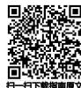
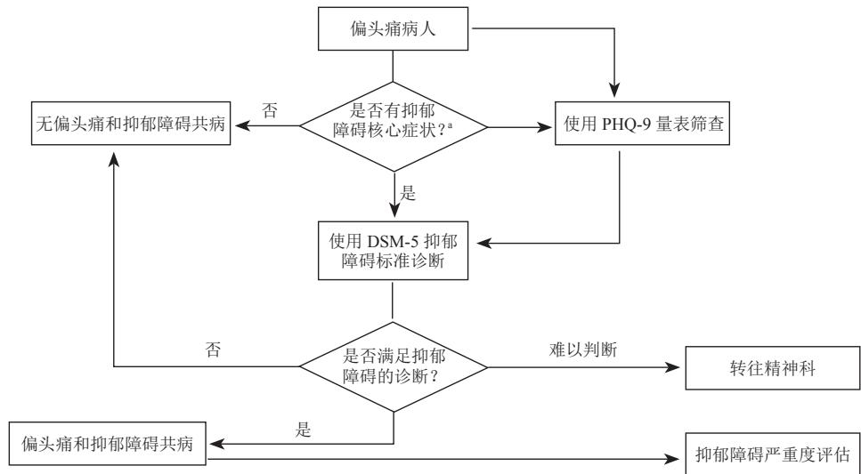
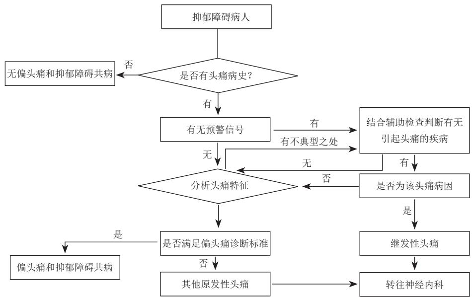

# 偏头痛与抑郁障碍共病诊治中国专家共识*

中国医师协会神经内科医师分会疼痛与感觉障碍学组

<!-- IMAGE_METADATA: {"type": "image", "page": 0, "image_idx": 0, "caption": "", "context_before": "中国医师协会神经内科医师分会疼痛与感觉障碍学组", "context_after": "一、前言", "extracted_from": "mineru_api"} -->

# 一、前言

偏头痛是一种常见的原发性头痛，严重影响病人的生活质量 [1]。抑郁障碍同样是严重的致残性疾病 [2]。研究表明由于共享多种发病机制，偏头痛与抑郁障碍共病颇为常见，且二者共病可能导致更复杂的症状和更差的预后 [3]，病人饱受痛苦。目前多数临床医师对二者共病的认识不足，缺乏识别诊断能力，使得偏头痛病人合并的抑郁障碍或抑郁状态常被忽视，而抑郁障碍病人中相当部分的偏头痛未被识别，这种忽视可能导致治疗效果不佳，亟需提高临床认知。加之二者分别归属不同学科疾病范畴，为共病的识别诊断及综合管理带来困难。从文献检索结果看，国内外尚缺乏针对偏头痛与抑郁障碍共病的指南或共识等指导性报道，为了更好地诊断及管理偏头痛与抑郁障碍共病，本共识编写组特邀请神经科及精神科临床专家共同参与，首次就偏头痛与抑郁障碍的共病进行系统的阐述和总结，并首次制定了筛查诊断路径，对治疗提供建议，以期提高临床医师对共病的识别诊断和综合管理能力，给予病人更有针对性的治疗，改善预后。

# 二、流行病学

国外数据显示，偏头痛的全球患病率为 $1 1 { \cdot } 6 \%$ [4]，抑郁障碍的全球患病率为 $4 { \cdot } 4 \%$ [5]。国内流行病学调查显示，我国偏头痛年患病率为 $9 . 3 \%$ ，其中女性年患病率达 $1 2 { \cdot } 8 \%$ [1]；抑郁障碍终生患病率为$6 { \cdot } 8 \%$ [2]。

偏头痛与抑郁障碍关系密切。早在 20 世纪 90年代，Breslau 等开展的大规模流行病学研究显示，偏头痛病人（与非偏头痛人群相比）患抑郁障碍的风险更高（相对风险RR, 3.2; $9 5 \% C I ,$ , 2.3-4.6），同样，抑郁障碍病人（与非抑郁人群相比）患偏头痛的风险也更高 (RR, 3.1; 95%CI, 2.0-5.0)（Mark 等，2013）。该研究首次揭示了偏头痛与抑郁障碍存在双向相关，互为危险因素。2019 年一项纳入 4 项队列研究和 12 项横断面研究的大样本系统综述和Meta 分析为偏头痛和抑郁障碍之间的关系提供了真实可靠的结果，分析数据显示，无论在纵向研究还是在横断面研究中，偏头痛均使抑郁障碍风险增加2 倍 [6]。 C

目前缺乏中国人群的偏头痛与抑郁障碍相关性的大规模流行病学调查，有小样本横断面研究揭示偏头痛人群中抑郁的发生率高于健康对照（张蓉等，2010）。此外，与发作性偏头痛相比，慢性偏头痛更容易合并抑郁（ $3 0 { \cdot } 0 \%$ vs. $5 6 . 6 \%$ ; OR, 3.05;95%CI 2.74-3.40；PHQ-9 量表评价）（Adams 等，2015）。相比较无先兆偏头痛，女性先兆偏头痛病人更容易合并抑郁 （Oedegaard 等，2006）。抑郁障碍伴偏头痛病人焦虑、抑郁及躯体症状量表得分较高（Hung 等，2015）。

不同研究间存在一定异质性，但总体来说，偏头痛病人的抑郁障碍患病风险是非偏头痛病人的$2 \sim 4$ 倍，抑郁障碍病人的偏头痛患病风险也约为$2 \sim 4$ 倍，两者存在双向相关性。

# 专家共识一：

偏头痛与抑郁障碍相互增加发病风险，两者存在双向相关性，需引起重视。

# 三、病因及发病机制

偏头痛与抑郁障碍共病的病因尚未完全明确，两者双向增加患病风险可能与他们共享遗传、环境、病理机制有关，也可能是一种障碍为另一种障碍所引发 [3]。

# 1.大脑结构基础

神经影像研究显示，异常的大脑结构和脑区功能连接为偏头痛与情感障碍共病的结构学基础。偏头痛病人疼痛网络灰质体积降低，前扣带回、杏仁核、海马旁回灰质体积的降低与头痛发作频率相关[7]，这些区域与应激网络有重合。在偏头痛的间歇期或发作期，存在多脑区过度活化，包括前扣带回皮层、前岛叶、前额叶皮层、海马和杏仁核 [8]，这些脑区同样也与抑郁相关。抑郁障碍病人接受选择性 5-羟色胺及去甲肾上腺素再摄取抑制剂 (SNRI) 如去甲文拉法辛治疗后，丘脑-皮质-导水管周围灰质(PAG)的疼痛网络连接密度降低，且与疼痛评分的下降呈正相关，提示抑郁障碍中存在疼痛通路异常，也佐证了SNRI类药物对与抑郁相关疼痛的治疗作用 [9]。

# 2. 神经递质异常

神经递质，尤其单胺递质异常是抑郁障碍发病机制的重要因素，也对偏头痛的发生发展有重要意义。无论情感网络的前额叶、海马、杏仁核，还是疼痛传导相关的 PAG、延髓头端腹内侧区 (RVM)、蓝斑 (LC)，均包含 5-羟色胺 (5-HT) 能、去甲肾上腺素 (NE) 能、多巴胺 (DA) 能神经元，其相互之间构成复杂联系，共同参与情感、行为、疼痛的调节。

（1）5-HT：为研究最为广泛的神经递质，具有调节 5-HT 或其受体作用的药物可用于治疗偏头痛（如曲普坦类）和抑郁障碍（如选择性 5-HT 再摄取抑制剂，即 SSRI 类药物）。但抑郁障碍病人脑内 5-HT 呈低下水平，而偏头痛病人脑内 5-HT 处于巨大的波动状态（Ferrari 等，1993），SSRI 类药物虽可显著缓解抑郁症状，但对偏头痛治疗无效 [10]，提示导致共病的递质异常不单纯集中于5-HT系统。  
（2）NE：NE 能神经元起源于蓝斑，既是疼痛下行传导通路的组成部分，也是情感通路的关键环节，NE系统的异常可能为共病的机制之一（Stahl等，2002）。  
（3）DA：偏头痛前驱症状多对多巴胺敏感[11]，抑郁也与多巴胺能系统紊乱相关 [11,12]。

（4） $\gamma \mathrm { . }$ -氨基丁酸 (gamma-aminobutyric acid, GABA)：是中枢神经系统中重要的抑制性神经递质，研究表明无论抑郁障碍病人还是偏头痛病人，扣带回皮质的 GABA 均处于低水平 [13,14]。托吡酯和丙戊酸既可作为偏头痛的预防药物，也可作为情感稳定剂治疗双相情感障碍，被认为与其可增加GABA能系统效率有关。

# 3. 遗传因素

偏头痛和抑郁均存在遗传倾向，且均存在多基因遗传背景。双胞胎研究提示偏头痛和抑郁大约$20 \%$ 的变异发生于共同的基因（Schur等，2009），其共享的遗传背景或可用来解释抑郁及偏头痛共病的原因。目前发现的与抑郁障碍和偏头痛相关的基因包括 5-HT 转运体 (5-HTT) 基因 (SLC6A4) 的启动子区 (5HTTLPR) [15]、多巴胺受体基因等位基因DRD2[16]和 DRD4[17]、GABA 能系统的GABRQ 和GABRA3基因[18]，这同样支持共病中神经递质的参与。另外，编码叶酸代谢关键酶—亚甲基四氢叶酸还原酶 (MTHFR) 基因，其 C677T 变异与有先兆偏头痛显著相关 [19]。研究同样表明此变异与抑郁障碍的发病相关 [20]，提示MTHFR C677T 可能也是偏头痛与抑郁障碍的共享基因之一。

# 4. 环境和应激因素

一项前瞻性队列研究探索多种应激源（如童年创伤、婚姻、经济和工作问题、慢性应激、社会支援的改变等）对偏头痛与抑郁障碍共病的影响，研究显示偏头痛和抑郁障碍之间存在双向相关，但矫正应激源后，二者相关性大幅衰减，提示应激在共病中的作用（Swanson 等，2013）。动物实验也同样证实此观点：不可预测的温和应激会导致大鼠抑郁，且加重上矢状窦电刺激所致的头痛行为学（Zhang等，2013）；反复化学刺激大鼠硬脑膜后，大鼠会产生显著的抑郁情绪，前额叶的 5-HT 及 DA水平显著降低 [21] ，提示头痛同样可能作为一种应激源，导致了抑郁的发生。

# 专家共识二：

偏头痛与抑郁障碍共病的发病机制可能涉及大脑结构及功能改变、神经递质功能异常、遗传因素（共享致病基因）、环境和应激因素等，也提示了未来的药物研发方向。

# 四、识别与筛查

筛查诊断与抑郁障碍共病的偏头痛时，头痛病史、头痛预警信号及头痛特征是重要的判断标准，同时需

结合辅助检查诊断/排除头痛相关原因。对于 $\textcircled{1}$ 伴头痛病史、无明显预警信号的抑郁障碍病人，或 $\textcircled{2}$ 伴头痛病史、头痛发作时虽有预警信号，但经辅助检查可排除导致头痛的其他原因时，若其头痛特征满足偏头痛标准，病人可诊断为偏头痛和抑郁障碍共病。

建议有条件的医院对慢性偏头痛病人、偏头痛规范治疗效果不佳的病人、转诊至头痛亚专科门诊的病人常规筛查，或通过问诊了解病人是否最近2周经常出现情绪低落、兴趣或乐趣丧失等核心症状后，使用如下的工具进行筛查： $\textcircled{1}$ 病人健康问卷-9(PHQ-9)：是临床研究及门诊中较常使用的病人自评工具（见表 1），简单、快速，也适合在头痛门诊中使用， $8 \sim 1 1$ 分作为临界评分可作为诊断参考的界值 [22]； $\textcircled{2}$ PHQ-15：适用于筛查躯体化障碍和评估躯体症状的严重度； $\textcircled{3}$ 其他可用的抑郁筛查工具：如贝克抑郁自评量表 (BDI)，他评量表如汉密尔顿抑郁量表 (HAMD)。以上量表目前仅 PHQ-9 在偏头痛人群中进行过诊断性验证 [23]。

# 专家共识三：

识别和筛查抑郁障碍病人是否共病偏头痛时，头痛病史、头痛预警信号及头痛特征是重要的判断标准。识别和筛查偏头痛病人是否共病抑郁障碍，尤其对于慢性偏头痛病人、偏头痛规范治疗效果不佳的病人、转诊至头痛亚专科门诊的病人，推荐使用PHQ-9量表进行常规筛查。

# 五、诊断及鉴别诊断

对共病的诊断需要同时符合偏头痛和抑郁障碍各自的诊断标准。二者的诊断均主要依据临床症状和体征，且两种疾病都具有发作性、易慢性化和易复发的特点。

# 1.偏头痛诊断标准

在国际头痛疾患分类第三版 (ICHD-3) 中，偏头痛主要包括无先兆偏头痛、有先兆偏头痛和慢性偏头痛，具体诊断标准分别见表 2、3 [24]。慢性偏头痛指病人每个月至少有15天头痛，至少有8天偏头痛发作，并至少持续3个月。慢性偏头痛一般由发作性偏头痛转化而来 [25]。偏头痛需要与丛集性头痛、紧张型头痛等其他原发性头痛相鉴别（见表4）。

# 2.抑郁障碍诊断标准

目前国际权威的2个分类诊断系统ICD和DSM对抑郁障碍的诊断都是基于关键症状的定义 [26,27]，其症状可以大致分为情感症状、躯体症状和神经认知症状，这 3 个维度的症状在其他精神和躯体疾病也可出现。

抑郁障碍包括多种疾病，最常见或具代表性的是重性抑郁障碍 (major depressive disorders, MDD)，即通常所说的抑郁症，其诊断标准见表 5。当抑郁症状存在，但数量或严重程度不足以被诊断为抑郁障碍时，可以诊断为阈下抑郁。

# 3.偏头痛与抑郁障碍共病的筛查诊断路径

本共识提供了 2 个筛查诊断路径供临床医师参考：偏头痛病人的抑郁障碍筛查诊断路径（见图 1）及抑郁障碍病人的偏头痛筛查诊断路径（见图 2）。

# 专家共识四：

当病人临床表现同时符合偏头痛和抑郁障碍的诊断标准时，即可诊断为偏头痛与抑郁障碍共病。二者的诊断标准：偏头痛可依据ICHD-3诊断，此外，应与紧张型头痛和丛集性头痛等其他原发性头痛及其他继发性头痛相鉴别；诊断抑郁障碍目前最常用的是DSM-5 诊断标准。

表 1 PHQ-9 量表  

<!-- TABLE_METADATA: {"type": "table", "page": 0, "table_idx": 0, "caption": "表 1 PHQ-9 量表", "footnote": "", "extracted_from": "mineru_api"} -->
<table><tr><td>在过去的两周里，你的生活中以下症状出现的频率有多少？</td><td>完全不会</td><td>好几天</td><td>超过1周</td><td>几乎每天</td></tr><tr><td>1.做事时提不起劲或没有兴趣</td><td>0</td><td>1</td><td>2</td><td>3</td></tr><tr><td>2.感到心情低落、沮丧或绝望</td><td>0</td><td>1</td><td>2</td><td>3</td></tr><tr><td>3.入睡困难、睡不安稳或睡眠过多</td><td>0</td><td>1</td><td>2</td><td>3</td></tr><tr><td>4.感觉疲倦或没有活力</td><td>0</td><td>1</td><td>2</td><td>3</td></tr><tr><td>5.食欲不振或吃太多</td><td>0</td><td>1</td><td>2</td><td>3</td></tr><tr><td>6.觉得自己很糟——或觉得自己很失败，或让自己和家人失望</td><td>0</td><td>1</td><td>2</td><td>3</td></tr><tr><td>7.对事物专注有困难，例如阅读报纸或看电视时</td><td>0</td><td>1</td><td>2</td><td>3</td></tr><tr><td>8.动作或说话速度缓慢到别人已经察觉？或正好相反——烦躁或坐立不安、动来动去的情况更胜于平常</td><td>0</td><td>1</td><td>2</td><td>3</td></tr><tr><td>9.有不如死掉或用某种方式伤害自己的念头</td><td>0</td><td>1</td><td>2</td><td>3</td></tr></table>

# 六、偏头痛与抑郁障碍共病的治疗

对共病治疗的目标是：早诊早治、兼顾精神症状和躯体症状、提高生存质量、恢复社会功能。由于偏头痛与抑郁障碍分属神经科和精神科疾病范

畴，治疗时在传统专科治疗的同时，应两个学科甚至多学科合作，尤其对于药物治疗效果不佳或不良反应明显者，应多学科全面综合有效评估，合理选择治疗手段，优势互补，形成个体化治疗方案。

表 2 无先兆偏头痛诊断标准 (ICHD-3) [24]

A. 至少有5次满足标准B-D的头痛发作  
B. 发作持续 4~72 h（未经治疗或治疗效果不佳）  
C. 头痛至少具有下列4项特征中的2项：

$\textcircled{1}$ 偏侧分布； $\textcircled{2}$ 搏动性； $\textcircled{3}$ 中或重度疼痛程度； $\textcircled{4}$ 日常活动导致头痛加重或头痛导致日常活动受限（如行走或登梯）

D. 头痛发作时至少具有下列1项：  
$\textcircled{1}$ 恶心和（或）呕吐； $\textcircled{2}$ 畏光和畏声

E. 不能用ICHD-3中的其他诊断更好地解释

表 3 有先兆偏头痛诊断标准 (ICHD-3) [24]

A. 至少有2次符合标准B和C的发作  
B. 至少有1个可完全恢复的先兆症状：

$\textcircled{1}$ 视觉； $\textcircled{2}$ 感觉； $\textcircled{3}$ 言语和（或）语言； $\textcircled{4}$ 运动； $\textcircled{5}$ 脑干； $\textcircled{6}$ 视网膜

C. 下列6项特征中至具少有3项：

$\textcircled{1}$ 至少1种先兆症状逐渐进展 $\geqslant 5 \mathrm { m i n }$ ； $\textcircled{2}$ 两种或多种症状相继出现； $\textcircled{3}$ 每个先兆症状持续 $5 { \sim } 6 0 ~ \mathrm { m i n }$ ； $\textcircled{4}$ 至少1个先兆症状是单侧的； $\textcircled{5}$ 至少有一个先兆是阳性的； $\textcircled{6}$ 与先兆伴发或在先兆出现 $6 0 \mathrm { { m i n } }$ 内出现头痛

D. 不能用ICHD-3中的其他诊断更好地解释

表4 常见原发性头痛的鉴别 [38]  
表 5 MDD 诊断标准 (DSM-5) [26]  

<!-- TABLE_METADATA: {"type": "table", "page": 0, "table_idx": 1, "caption": "表4 常见原发性头痛的鉴别 [38] 表 5 MDD 诊断标准 (DSM-5) [26]", "footnote": "", "extracted_from": "mineru_api"} -->
<table><tr><td></td><td>偏头痛</td><td>紧张型头痛</td><td>丛集性头痛</td></tr><tr><td>家族史</td><td>多有</td><td>可有</td><td>多无</td></tr><tr><td>性别</td><td>女性多于男性</td><td>女性略多于男性</td><td>男性远多于女性</td></tr><tr><td>持续时间</td><td>4~72 h</td><td>30 min~7 d</td><td>15~180 min</td></tr><tr><td>头痛部位</td><td>多单侧</td><td>多双侧</td><td>固定单侧眶部、眶上、颞部</td></tr><tr><td>头痛性质</td><td>搏动性</td><td>压迫、紧缩、钝痛</td><td>锐痛、钻痛</td></tr><tr><td>头痛程度</td><td>中重度</td><td>轻中度</td><td>重度或极重度</td></tr><tr><td>活动加重头痛</td><td>多有</td><td>多无</td><td>多无</td></tr><tr><td>伴随症状</td><td>多有恶心、呕吐、畏光、畏声</td><td>多无。可伴食欲不振、对光线或声音可轻度不适</td><td>同侧结膜充血和（或）流泪、鼻塞和（或）流涕、眼睑水肿、额面部出汗、瞳孔缩小及（或）眼睑下垂</td></tr></table>

A.在同一个2周的时间段内出现5个（或更多）下列症状，并且呈现功能的改变；出现的症状当中至少有1项是 $\textcircled{1}$ 心境抑郁或 $\textcircled{2}$ 兴趣或乐趣丧失。注：明确由其他躯体疾病导致的症状不包括在内

$\textcircled{1}$ 几乎每天大部分时间都心境抑郁，既可以是主观的报告，也可以是他人的观察  
$\textcircled{2}$ 几乎每天或每天的大部分时间，对于所有或几乎所有的活动兴趣或乐趣都明显减少  
$\textcircled{3}$ 在未节食的情况下体重明显减轻，或体重增加，或几乎每天食欲都减退或增加  
$\textcircled{4}$ 几乎每天都失眠或睡眠过多  
$\textcircled{5}$ 几乎每天都精神运动性激越或迟滞  
$\textcircled{6}$ 几乎每天都疲劳或精力不足   
$\textcircled{7}$ 几乎每天都感到自己毫无价值，或过分的、不适当的感到内疚  
$\textcircled{8}$ 几乎每天都存在思考或注意力集中的能力减退或犹豫不决  
$\textcircled{9}$ 反复出现死亡的想法，反复出现没有特定计划的自杀观念，或有某种自杀企图，或有某种实施自杀的特定计划

B.症状导致病人出现具有临床意义的痛苦或社会功能、职业功能或其他重要领域功能的损害  
C.抑郁发作不是由物质或其他疾病导致的心理反应所造成的  
D.抑郁发作不能被分裂情感性障碍、精神分裂症、精神分裂样障碍、妄想障碍、或其他特定和非特定精神分裂症谱系障碍及其他精神病性障碍所解释  
E.病人从未有躁狂发作或轻躁狂发作

<!-- IMAGE_METADATA: {"type": "image", "page": 4, "image_idx": 1, "caption": "", "context_before": "", "context_after": "", "extracted_from": "mineru_api"} -->
  
a：抑郁障碍的核心症状为“情绪低落”和“兴趣或乐趣丧失”

<!-- IMAGE_METADATA: {"type": "image", "page": 4, "image_idx": 2, "caption": "图1 偏头痛病人的抑郁障碍筛查诊断路径 图2 抑郁障碍病人的偏头痛筛查诊断路径", "context_before": "", "context_after": "1. 药物治疗 ", "extracted_from": "mineru_api"} -->
  
图1 偏头痛病人的抑郁障碍筛查诊断路径  
图2 抑郁障碍病人的偏头痛筛查诊断路径

# 1. 药物治疗

（1）药物治疗的原则：药物治疗是目前临床治疗偏头痛与抑郁障碍共病的主要治疗方式，其治疗方案的制订建议遵循如下原则 [28,29]： $\textcircled{1}$ 用药种类尽量少，优先选择有多重作用的药物，尽量达到“一石二鸟”的效果； $\textcircled{2}$ 如果多药联合，应充分考虑药物相互作用及不良反应的叠加； $\textcircled{3}$ 避免使用可以治疗一类疾病，但同时可能加重另外一类疾病的药物；$\textcircled{4}$ 在安全性和耐受性之外，应充分考虑病人对治疗的满意度以及依从性； $\textcircled{5}$ 考虑两种疾病的特点和治疗周期：如偏头痛的急性期治疗不宜过频繁，而抑郁障碍的治疗包括急性期、巩固期和维持期，需要

全病程治疗。

共病治疗药物概述：目前缺少针对偏头痛与抑郁障碍共病人群的随机对照研究(RCT)。专家组仅依据偏头痛和抑郁障碍两个疾病领域各自的RCT研究及证据和国内外指南推荐以及临床经验制订[30~34]。要点提炼如下： $\textcircled{1}$ 在偏头痛及抑郁障碍人群各有 2个以上 RCT 疗效证据，并被 2 类指南均推荐的药物为：文拉法辛和阿米替林（其推荐等级见表6）；$\textcircled{2}$ 偏头痛急性期治疗药物和其他预防性治疗药物，未见被推荐用于抑郁障碍的治疗； $\textcircled{3}$ 禁忌或需慎用的药物：抑郁障碍禁用氟桂利嗪；同时使用曲普坦类和 SSRI/SNRI 类等可作用于 5-HT 的药物，尤

其是SSRI类，需谨慎出现5-羟色胺综合征的风险 [35]。

（2）偏头痛急性发作期治疗药物：常用的治疗药物包括非处方药和处方药，按照作用机制分类，包括非甾体类抗炎药 (non-steroidal anti-inflammatorydrugs, NSAIDs)、曲普坦类和麦角胺类等 [36]。

药物选择时应根据头痛的严重程度、伴随症状、既往用药情况及病人的个体情况而定，可以采用分层法或阶梯法用药。药物应在头痛的早期足量使用，延迟使用可使疗效下降、头痛复发及不良反应的比例增高。为预防药物过量性头痛，单纯NSAIDs 制剂每月不超过 15 天，麦角碱类、曲普坦类、NSAIDs 复合制剂每月不超过10天。

（3）偏头痛的预防性治疗：通常偏头痛存在以下情况时应考虑预防性治疗： $\textcircled{1}$ 病人的生活质量、工作和学业严重受损（需根据病人本人判断）； $\textcircled{2}$

每月发作频率 2 次以上； $\textcircled{3}$ 急性期药物治疗无效或病人无法耐受； $\textcircled{4}$ 存在频繁、长时间或令病人极度不适的先兆，或为偏头痛性脑梗死、偏瘫型偏头痛、伴有脑干先兆偏头痛亚型等； $\textcircled{5}$ 连续 2 个月，每月使用急性期治疗 $6 \sim 8$ 次以上； $\textcircled{6}$ 偏头痛发作持续$^ { 7 2 \mathrm { ~ h ~ } }$ 以上。

预防性治疗药物：目前有多种药物可用于偏头痛的预防，包括抗抑郁药、 $\beta$ 受体阻滞剂、非特异性钙离子拮抗剂、抗惊厥药物等 [36,37] ，药物及推荐剂量、证据等级、药物不良反应等见表 7。其中部分药物可能导致抑郁障碍的风险增加应谨用或禁用。 $\textcircled{1}$ 抗抑郁药：阿米替林和文拉法辛，预防偏头痛的疗效均有多个 RCT 证实，二者均被 2009年欧洲偏头痛指南及 2012 年美国偏头痛指南列为偏头痛预防药物 B 类推荐 [30,33]。文拉法辛在预防

表6 偏头痛指南及抑郁障碍防治指南重叠推荐的药物  

<!-- TABLE_METADATA: {"type": "table", "page": 0, "table_idx": 2, "caption": "表6 偏头痛指南及抑郁障碍防治指南重叠推荐的药物", "footnote": "* A级：强烈推荐，疗效确切，且疗效安全性平衡；B级：建议，有疗效/疗效安全性平衡欠佳", "extracted_from": "mineru_api"} -->
<table><tr><td></td><td>偏头痛指南中的推荐等级</td><td>抑郁障碍指南中的推荐等级</td></tr><tr><td>文拉法辛</td><td>B</td><td>A</td></tr><tr><td>阿米替林</td><td>B</td><td>B</td></tr></table>

* A级：强烈推荐，疗效确切，且疗效安全性平衡；B级：建议，有疗效/疗效安全性平衡欠佳

表7 偏头痛预防性治疗处方药物推荐 [36]   

<!-- TABLE_METADATA: {"type": "table", "page": 0, "table_idx": 3, "caption": "表7 偏头痛预防性治疗处方药物推荐 [36] ", "footnote": "", "extracted_from": "mineru_api"} -->
<table><tr><td>药物</td><td>每日剂量(mg)</td><td>推荐级别</td><td>不良反应</td><td>禁忌证</td></tr><tr><td>钙离子拮抗剂</td><td></td><td></td><td></td><td></td></tr><tr><td>氟桂利嗪</td><td>5~10</td><td>A</td><td>常见:嗜睡、体重增加;少见:抑郁、锥体外系症状</td><td>抑郁、锥体外系症状</td></tr><tr><td>抗惊厥药</td><td></td><td></td><td></td><td></td></tr><tr><td>丙戊酸</td><td>500~1200</td><td>A</td><td>恶心、体重增加、嗜睡、震颤、脱发、肝功能异常</td><td>肝病</td></tr><tr><td>托吡酯</td><td>25~100</td><td>A</td><td>共济失调、嗜睡、认知和语言障碍、感觉异常、体重减轻</td><td>对有效成分或磺胺过敏</td></tr><tr><td>加巴喷丁</td><td>1200~2400</td><td>B</td><td>恶心、呕吐、抽搐、嗜睡、共济失调、眩晕</td><td>加巴喷丁过敏</td></tr><tr><td>β受体阻滞剂</td><td></td><td></td><td></td><td></td></tr><tr><td>美托洛尔</td><td>50~200</td><td>A</td><td>常见:心动过缓、低血压、嗜睡、无力、运动耐量降低</td><td></td></tr><tr><td>普萘洛尔</td><td>40~240</td><td>A</td><td>少见:失眠、噩梦、阳痿、抑郁、低血糖</td><td>哮喘、心衰、房室传导阻滞、心动过缓;慎用于使用胰岛素或降糖药者</td></tr><tr><td>比索洛尔</td><td>5~10</td><td>B</td><td>心动过缓、头晕、头痛、肢端发冷或麻木、低血压、胃肠道症状、衰弱、疲劳、</td><td>急性心力衰竭或处于心力衰竭失代偿期需用静脉正性肌力药物治疗、心源性休克者等</td></tr><tr><td>抗抑郁药</td><td></td><td></td><td></td><td></td></tr><tr><td>文拉法辛</td><td>75~225</td><td>B</td><td>恶心、口干、头痛和出汗</td><td>对本药过敏者、禁止同时使用MAOs</td></tr><tr><td>阿米替林</td><td>25~75</td><td>B</td><td>口干、嗜睡、体重增加</td><td>青光眼、前列腺增生</td></tr><tr><td>其他药物</td><td></td><td></td><td></td><td></td></tr><tr><td>坎地沙坦</td><td>16</td><td>B</td><td>血管性水肿、晕厥和意识丧失、急性肾功能衰竭、血钾升高、肝功能恶化或黄疸、粒细胞减少、横纹肌溶解</td><td>对本药或同类药过敏者、严重肝、肾功能不全或胆汁淤滞者、孕妇或有妊娠可能的妇女</td></tr><tr><td>赖诺普利</td><td>20</td><td>B</td><td>咳嗽、头晕、头痛、心悸、乏力</td><td>对本药或其他同类药物过敏、高钾血症、双侧肾动脉狭窄、孤立肾有肾动脉狭窄者、妊娠中期或末期3个月</td></tr></table>

偏头痛方面疗效与阿米替林相当，但安全性优于阿米替林 [38,39]； $\textcircled{2} \beta$ 受体阻滞剂：在偏头痛预防性治疗方面效果明确，并被多国指南推荐为偏头痛预防治疗的A级推荐药物，但与抑郁障碍之间的关系一直存在争议 [40~42]，故应用时需谨慎； $\textcircled{3}$ 非特异性钙离子拮抗剂：氟桂利嗪对偏头痛的预防性治疗证据充足，为偏头痛预防的多国指南 A 级推荐药物。但合并抑郁为用药禁忌； $\textcircled{4}$ 抗惊厥药：托吡酯和丙戊酸是偏头痛预防性药物的 A 类推荐。双丙戊酸钠/丙戊酸钠可有效预防偏头痛 [43]，无增加抑郁的风险 [44]，托吡酯会增加抑郁发生和再发风险 [45]，应慎用，需小剂量起始缓慢加量。

抑郁障碍的治疗药物：目前指南推荐的常用的抗抑郁药物类别及剂量见表 8，一线药物及 A 级推荐药物主要包括 SSRI 类、SNRI 类和 NaSSA 类药物等 [46]，三环类药物和 MAOIs 因其耐受性与安全性问题较大，临床上已很少使用 [46] 。

除已提及的文拉法辛（SNRI 类）和阿米替林（三环类）被推荐用于偏头痛的预防性治疗之外，

还应注意： $\textcircled{1}$ SSRI 类抗抑郁药物在偏头痛人群的使用目前存在争议。SSRI 类药物最初会加剧偏头痛和紧张型头痛，这些影响有可能在几周内获得改善；继续治疗 SSRI 类可能有助于预防和治疗偏头痛；不建议给接受曲普坦类治疗的偏头痛病人处方SSRI类药物 [32]； $\textcircled{2}$ 药物治疗需要保证足够剂量、全病程治疗；抑郁障碍治疗的全病程策略包括急性期（8～12周）、巩固期（ ${ . 4 } \sim 9$ 个月）、维持期（目前尚无研究定论，一般倾向于至少 $2 \sim 3$ 年） [43]。

# 2.非药物治疗

基于疗效和安全性考虑，药物治疗存在一定局限性。近年来，可以治疗偏头痛和抑郁障碍的非药物治疗方法不断进步，卓有成效。临床医师可以根据医院条件、病人个体化情况和意愿选择非药物治疗方案，尤其当出现下列情况时，非药物治疗可以作为替代或补充方案考虑： $\textcircled{1}$ 药物不耐受或有药物禁忌证； $\textcircled{2}$ 药物疗效不佳； $\textcircled{3}$ 特殊人群（如妊娠、哺乳、老年、青少年等）。

（1）心理治疗：偏头痛与抑郁障碍共病的病

表8 常用抗抑郁药  

<!-- TABLE_METADATA: {"type": "table", "page": 0, "table_idx": 4, "caption": "表8 常用抗抑郁药", "footnote": "5-HT：5-羟色胺；SSRI：选择性 5-羟色胺再摄取抑制剂；SNRI：选择性 5-羟色胺和去甲肾上腺素再摄取抑制剂；NaSSA：去甲肾上腺素和特异性 5-羟色胺能抗抑郁药；NDRI：去甲肾上腺素和多巴胺再摄取抑制剂；NRI：选择性去甲肾上腺素再摄取抑制剂；SARI：选择性 5-羟色胺拮抗/再摄取抑制剂；RIMA：可逆性单氨氧化酶抑制剂；TCA：三环类抗抑郁药；SMA：5-羟色胺平衡抗抑郁药；MAOI：单胺氧化酶抑制剂；MT：褪黑素", "extracted_from": "mineru_api"} -->
<table><tr><td>抗抑郁药</td><td>药物类别</td><td>日剂量范围 (mg)</td></tr><tr><td>氟西汀</td><td>SSRI</td><td>20~60</td></tr><tr><td>帕罗西汀</td><td>SSRI</td><td>20~50</td></tr><tr><td>氟伏沙明</td><td>SSRI</td><td>100~300</td></tr><tr><td>舍曲林</td><td>SSRI</td><td>50~200</td></tr><tr><td>西酞普兰</td><td>SSRI</td><td>20~60</td></tr><tr><td>艾司西酞普兰</td><td>SSRI</td><td>10~20</td></tr><tr><td>文拉法辛</td><td>SNRI</td><td>75~225</td></tr><tr><td>度洛西汀</td><td>SNRI</td><td>60~120</td></tr><tr><td>米氮平</td><td>NaSSA</td><td>15~45</td></tr><tr><td>米纳普仑</td><td>SNRI</td><td>100~200</td></tr><tr><td>安非他酮</td><td>NDRI</td><td>150~450</td></tr><tr><td>阿戈美拉汀</td><td>MT1 和 MT2 激动剂; 5-HT2拮抗剂</td><td>25~50</td></tr><tr><td>阿米替林</td><td>TCA</td><td>50~250</td></tr><tr><td>氯米帕明</td><td>TCA</td><td>50~250</td></tr><tr><td>多塞平</td><td>TCA</td><td>50~250</td></tr><tr><td>丙米嗪</td><td>TCA</td><td>50~250</td></tr><tr><td>马普替林</td><td>四环类</td><td>50~225</td></tr><tr><td>米安色林</td><td>四环类</td><td>30~90</td></tr><tr><td>曲唑酮</td><td>SMA</td><td>50~400</td></tr><tr><td>瑞波西汀</td><td>NRI</td><td>8~12</td></tr><tr><td>吗氯贝胺</td><td>RIMA</td><td>150~600</td></tr></table>

5-HT：5-羟色胺；SSRI：选择性 5-羟色胺再摄取抑制剂；SNRI：选择性 5-羟色胺和去甲肾上腺素再摄取抑制剂；NaSSA：去甲肾上腺素和特异性 5-羟色胺能抗抑郁药；NDRI：去甲肾上腺素和多巴胺再摄取抑制剂；NRI：选择性去甲肾上腺素再摄取抑制剂；SARI：选择性 5-羟色胺拮抗/再摄取抑制剂；RIMA：可逆性单氨氧化酶抑制剂；TCA：三环类抗抑郁药；SMA：5-羟色胺平衡抗抑郁药；MAOI：单胺氧化酶抑制剂；MT：褪黑素

人有条件时应该接受心理支持治疗。心理治疗的手段有多种，其中认知行为治疗强调改变行为和思想的重要性，这些行为和思想可能是偏头痛与抑郁障碍共病的维持因素（Smitherman 等，2008）。同时病人教育、社会支持在偏头痛与抑郁障碍共病的治疗中同样非常必要。此外，生物反馈治疗抑郁的临床有效性已被多项研究证实（Schoenberg 等，2014）。放松训练可能改善病人负性情绪和疼痛及多种躯体不适。

（2）神经调控技术：神经调控技术中证据比较充分的是经颅磁刺激 (transcranial magnetic stimula-tion, TMS) 和经颅直流电刺激 (transcranial direct-cur-rent stimulation, tDCS)。重复 TMS (rTMS) 目前在有的国家已获批用于治疗抑郁障碍，美国 FDA 先后批准单脉冲 TMS (sTMS) 用于有先兆偏头痛的急性期治疗和偏头痛的预防性治疗，sTMS 也可用于改善慢性偏头痛 [47]。tDCS 是预防和治疗偏头痛的安全、有效手段，能降低头痛发作次数及持续时间，缓解头痛程度，可调节自主神经功能，疗效明显优于单纯药物治疗[48]。

此外，经皮电刺激神经疗法(TENS)是一种非侵入性神经刺激技术，可以改善抑郁症状，近年来也有研究报道其在偏头痛急性发作和预防性治疗中的疗效（Shealy等，2003）。电针治疗是一种侵入性较小的神经调控技术，可用于治疗抑郁障碍，也可用于减轻原发性头痛病人的严重程度、残疾和抑郁评分，是难治性原发性头痛伴发抑郁的有利选择 [49]。迷走神经刺激(VNS)可治疗重性抑郁发作，慢性VNS用于治疗难治性抑郁合并偏头痛严重影响生活质量的病人，是一种有效的替代方案（Cecchini等，2009）。

# 专家共识五：

药物治疗是对偏头痛和抑郁障碍共病治疗的主要方式，方案的制订原则包括尽量使用对二者共同有效或机制作用可互补的药物，兼顾安全性，药物相互作用及治疗的病程要求等。

非药物治疗主要包括心理治疗和神经调控技术，可进行联合使用或单独使用。

治疗应多学科全面综合有效评估，合理选择治疗手段，优势互补，形成个体化治疗方案。

# 七、综合管理

偏头痛与抑郁障碍均属于慢性疾病，疾病的发生、进展及波动受到多种风险因素的促发，因此对于高危个体或已明确诊断的病人，应进行长期及全

病程管理，以降低疾病的发生和复发风险、提高病人生活质量和治疗预后。管理策略包括：

# 1.健康教育

包括偏头痛和抑郁障碍的疾病知识、患病的危险因素、症状表现、病程发展、治疗方法、预后以及治疗依从性的重要性。帮助病人适应全程的治疗，确立科学和理性的防治观念与目标，选择适合于病人个体的现实目标和预期，提高病人生活质量和社会功能。

# 2.危险因素管理

对于共病病人，需行全面评估，个体化识别危险因素，针对危险因素进行早期的干预和管理。如有阳性家族史、创伤性生活经历或出现前驱症状的个体，可通过行为指导、自我认知调整、专业的心理咨询以及积极的社会支持，帮助个体选择健康生活方式、坚持个体化的运动方案、矫正偏差的认知模式、重建积极的社会支持等，减少偏头痛和抑郁障碍的发病。

# 3.病人的康复期管理

偏头痛和抑郁障碍均需要全程综合治疗。定期对病人进行随访，实施基于评估的治疗策略，帮助病人学习应对策略以避免诱发因素对疾病复发的影响，教育并鼓励病人记头痛日记、情绪日记等，发展个人的兴趣爱好，使精神活动能指向积极快乐的事情和环境；增强人际交往。使病人保持痊愈、良好的生活质量和有效的社会功能。

# 专家共识六：

偏头痛与抑郁障碍均属于慢性疾病，需要进行长期及全病程管理，以降低疾病的发生和复发风险和改善治疗预后，常见的管理策略包括：健康教育、危险因素管理及病人的康复期管理。

# 八、小结

偏头痛与抑郁障碍的病因尚未完全明确，其双向关联可能与他们共享遗传、环境、病理机制有关。偏头痛与抑郁障碍关系密切，在临床上，二者的共病易被忽视，可能导致治疗效果不佳或疾病迁延加重等，因此，应充分关注偏头痛与抑郁障碍共病的筛查、诊断与管理。偏头痛与抑郁障碍共病的治疗包括药物治疗和非药物治疗等方式。药物治疗考虑的因素包括选择有多重作用的药物、选择对精神症状和躯体症状均有疗效的药物、药物的安全性及相关的不良反应、药物与疾病自身的相互作用和耐受性，后者包括药理学相互作用和病人对治疗的满意程度以及依从性。非药物治疗可根据病人个体化情况和意愿选择，可与药物联合使用或单独使用。